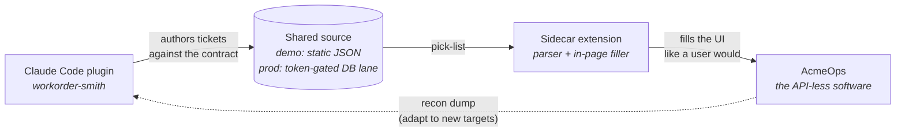
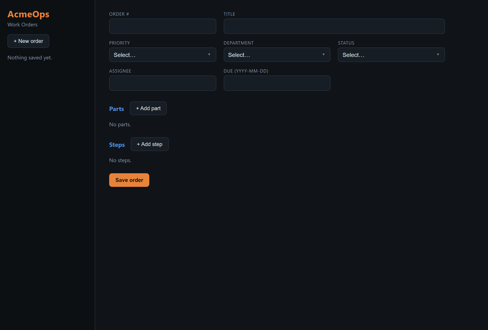
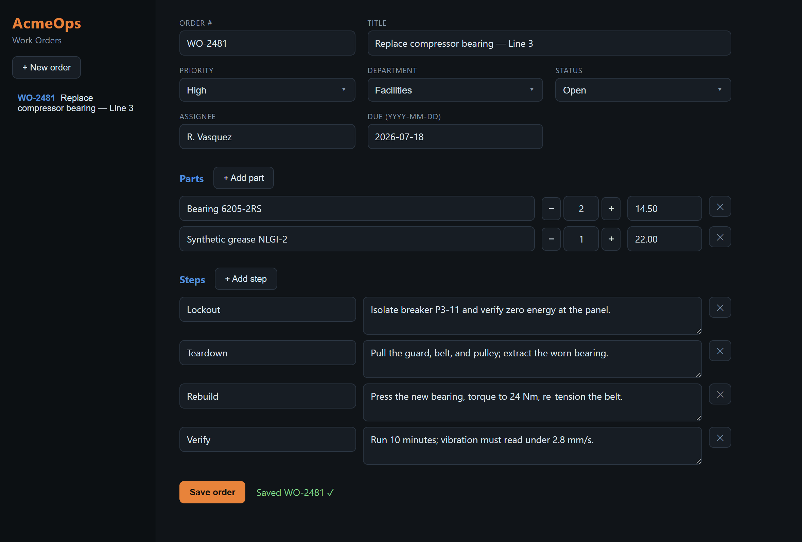

# sidecar-demo — Claude Code marketplace + sidecar, end to end

A self-contained demo of the pattern behind our client work: **when the
business-critical software has no API (or a bad one), a Claude Code plugin
authors the structured payload, and a thin browser-extension sidecar lands it in
the software's UI the way a user would.** No vendor cooperation, no waiting on
an integration roadmap.



| Before | After one click |
|---|---|
|  |  |

The three pieces, all in this repo:

| Piece | Plays the role of |
|---|---|
| [`app/`](app) — **AcmeOps Work Orders**, a static React app (GitHub Pages) | The niche software: an internal tool with fiddly custom controls and **no API** — state lives in the UI and localStorage only. Stand-in for the legacy ERP / vertical SaaS / vendor portal every business has. |
| [`extension/`](extension) — the **sidecar** (Chrome MV3) | The integration: pulls tickets from a shared source, parses them against a strict contract, and fills the AcmeOps UI in-page — custom dropdowns, dynamic rows, idempotent re-fill, honest per-field MISS reporting. |
| [`plugins/workorder-smith/`](plugins/workorder-smith) + the root marketplace | The Claude Code lane: this repo **is** an installable plugin marketplace; the plugin's skill authors tickets in the exact contract format the sidecar parses. |

## Run the demo (~3 minutes)

1. **Open the app:** https://father-pumpkin.github.io/sidecar-demo/ (or locally:
   `cd app && npm install && npm run dev`).
2. **Load the sidecar:** `chrome://extensions` → Developer mode → *Load
   unpacked* → the `extension/` folder.
3. **Fill:** open the AcmeOps tab, click the extension icon, pick a ticket
   (they're served from the app's own `tickets.json` — the "shared source"),
   and watch it drive the form: dropdowns click open, part/step rows add
   themselves, quantities land. Pick a *different* ticket to see the
   **idempotent re-fill** delete surplus rows. Then **Save order**.
4. **The Claude lane:** add this repo as a marketplace
   (`claude plugin marketplace add Father-Pumpkin/sidecar-demo`), install
   `workorder-smith`, and run `/workorder-smith:draft replace the dock door
   motor`. Paste the resulting ticket into the sidecar's manual box → Fill.

That's the full loop: **Claude authors → contract carries → sidecar lands it in
software that has no API.**

**The enterprise variant** — with the **official Outlook / Microsoft 365
connector** connected (a catalog item, zero custom code): send yourself a
work-request email, then `/workorder-smith:intake latest`. Claude reads the
request from the inbox, drafts the contract ticket, you land it with the
sidecar, and Claude replies to the requester with the WO number. **Email in →
API-less software → email out.** The point for a business audience: a custom
plugin's skill orchestrates *official* connectors alongside custom ones and the
sidecar — you only build what's genuinely bespoke.

Presenting it live? [`docs/DEMO-SCRIPT.md`](docs/DEMO-SCRIPT.md) has the
90-second beat sheet and the objection answers. The closer is the sidecar's
**Adapt to new software → Inspect** button: run it on *any* app the prospect
names — the DOM dump it copies is exactly what Claude turns into a new selector
block, which is how this whole demo got built.

## Why this matters (the business mapping)

- **The contract is the integration.** `ticket-contract.md` plays the role an
  API spec would — except *we* define it, version it, and validate against it.
- **The sidecar is ~300 lines** and uses only standard extension APIs
  (`scripting` + host permission). The techniques that make it reliable — native
  value setters so React state updates, driving custom dropdowns like a user,
  selector isolation in one block, idempotent row management, per-field MISS
  logs — are documented in [`docs/sidecar-pattern.md`](docs/sidecar-pattern.md).
- **The shared ticket source is a static JSON here**; in production it's a
  token-gated REST lane on a hosted MCP service with a least-privilege DB role,
  so Claude writes and the sidecar reads with proper auth. (Our production
  reference implements exactly that.)
- **This scales past demos:** same shape works for order entry into a legacy
  ERP, patient/case data into a portal, listings into a vendor console — any
  "swivel-chair" workflow a team does by hand today.

## Repo anatomy

```
.claude-plugin/marketplace.json      the repo IS a Claude Code marketplace
plugins/workorder-smith/             plugin: command + skill + ticket contract
app/                                 AcmeOps (Vite + React, deployed to Pages)
extension/                           the sidecar (MV3; parser + filler + popup)
docs/sidecar-pattern.md              the generalized pattern write-up
.github/workflows/deploy-pages.yml   builds app/ → GitHub Pages
```

## Honest limits of the demo

- The sidecar targets this app's selectors; pointing it at different software
  means a new selector block + contract (that adaptation *is* the engagement).
- Chrome-only as packaged (MV3); Edge works via the same store format.
- The static ticket source is world-readable by design here — production uses
  the token-gated lane described above.
